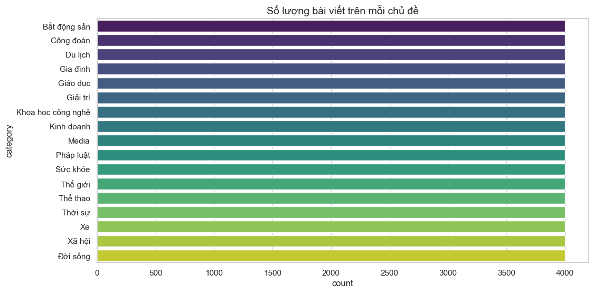
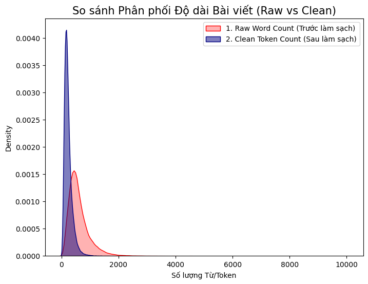
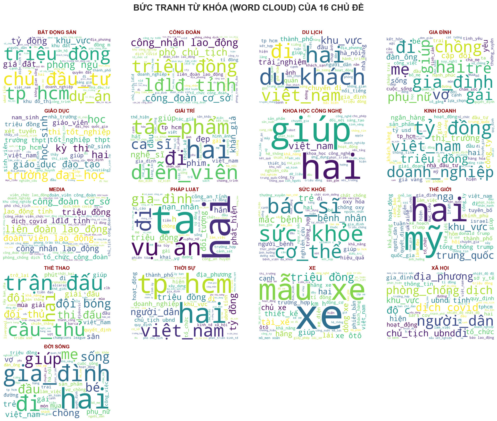
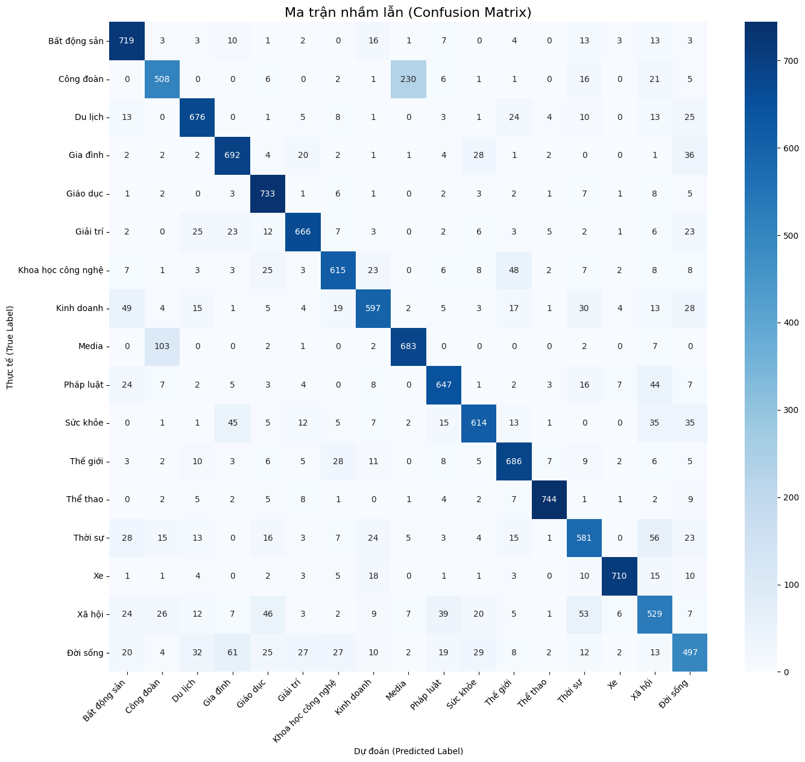
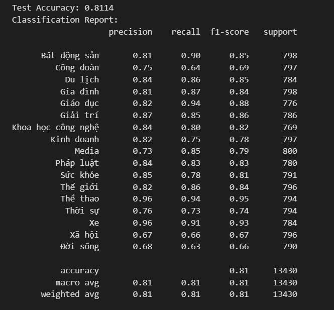

# VN News Hierarchical Classification

## Table of Contents
- [VN News Hierarchical Classification](#vn-news-hierarchical-classification)
  - [Table of Contents](#table-of-contents)
  - [Introduction](#introduction)
  - [Features](#features)
  - [Installation](#installation)
  - [Data](#data)
  - [Approach](#approach)
  - [Model](#model)
  - [Deployment](#deployment)
  - [Usage](#usage)
  - [Results](#results)

## Introduction
The **VN News Hierarchical Classification** project is a Vietnamese news classification system that assigns hierarchical labels to news articles using machine learning. This project aims to support efficient news organization and analysis.

## Features
- Hierarchical classification of Vietnamese news articles.
- Vietnamese text preprocessing and cleaning.
- Machine learning and natural language processing techniques.
- Web application deployment for demonstration and use.

## Installation
1. Clone this repository:
   ```bash
   git clone <repository-url>
   cd VNNewsClassification
   ```

2. Install required libraries:
   ```bash
   pip install -r requirements.txt
   ```

3. Download the dataset from [Google Drive](https://drive.google.com/drive/folders/1wVbwVoVhSVCKcp_w7pkfmdePHkRSeu3o?usp=sharing) and place it in the `Data/` folder.

## Data
This project uses Vietnamese news datasets that have been collected and preprocessed for modeling. Main dataset files include:
- `data_full_crawl_balanced.csv`: Original raw dataset.
- `vietnamese_news_cleaned_raw.csv`: Cleaned raw dataset.
- `vietnamese_news_for_modeling.csv`: Data prepared for modeling.
- `vietnamese_news_preprocessed.csv`: Preprocessed dataset.

The repository also contains `vietnamese-stopwords.txt`, which lists Vietnamese stopwords used during preprocessing.

- Total dataset size: approximately `68,000` news articles.
- Number of labels: `17` distinct categories.

The chart below shows label balance across categories:



## Approach
The project follows these main stages:
1. **Exploratory Data Analysis (EDA)**: Analyze and understand dataset structure and category distribution (see `src/EDA.ipynb`).
2. **Preprocessing**: Clean and normalize text data (see `src/Pre-processing.ipynb`).
3. **Feature Engineering**: Extract features from the text data (see `src/Feature Engineering.ipynb`).
4. **Model Training**: Build and train the classification model (see `src/Train.ipynb`).

## Model
The trained model files are stored in the `models/` directory. Feature pipelines and label artifacts are stored in `pipelines/`, including `X_features.npy` and `y_labels.npy`.

## Deployment
The application is deployed with FastAPI. To run the application:

```bash
uvicorn app:app
```

Open `http://localhost:8000` to access the web interface. Frontend files are located in `templates/index.html` and `templates/styles/style.css`.

## Usage
- Use the notebooks in `src/` for data exploration and model training.
- Run the web application to classify new news articles from the browser interface.

## Results
- **Data distribution before and after preprocessing:**
  
- **Common words by topic:**
  
- **Confusion matrix for topic classification:**
  
- **Model accuracy after training:**
  

